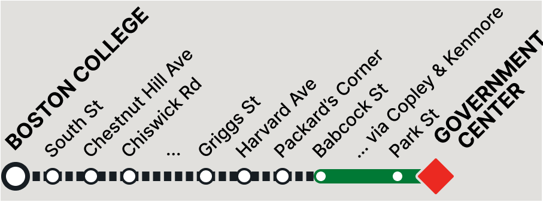
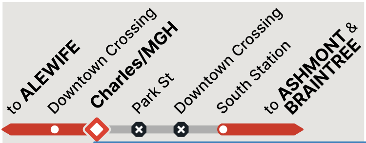
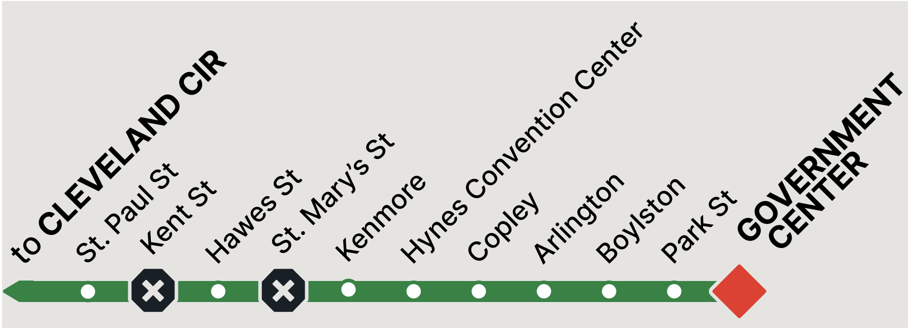

# Disruption diagram serialization examples

## Example 1: Shuttle from Boston College to Babcock St, screen at Government Center


```ts
{
  l_end: {
    station_id: "place-lake",
    symbol: {icon: "shuttled", color: "black"}
  },
  r_end: {
    station_id: "place-gover",
    symbol: "you-are-here"
  },
  middle_nodes: [
    {
      label: {full: "South Street", abbrev: "South St"},
      symbol: {icon: "shuttled", color: "black"}
    },
    {
      label: {full: "Chestnut Hill Avenue", abbrev: "Chestnut Hill Ave"},
      symbol: {icon: "shuttled", color: "black"}
    },
    {
      label: {full: "Chiswick Road", abbrev: "Chiswick Rd"},
      symbol: {icon: "shuttled", color: "black"}
    },
    {
      label: "…",
      symbol: null
    },
    {
      label: {full: "Griggs Street", abbrev: "Griggs St"},
      symbol: {icon: "shuttled", color: "black"}
    },
    {
      label: {full: "Harvard Avenue", abbrev: "Harvard Ave"},
      symbol: {icon: "shuttled", color: "black"}
    },
    {
      label: {full: "Packard's Corner", abbrev: "Packard's Cn"},
      symbol: {icon: "shuttled", color: "black"}
    },
    {
      label: {full: "Babcock Street", abbrev: "Babcock St"},
      symbol: {icon: "open", color: "green"}
    },
    {
      label: {full: "… via Copley & Kenmore", abbrev: "… via Copley & Kenmore"},
      symbol: null
    },
    {
      label: {full: "Park Street", abbrev: "Park St"},
      symbol: {icon: "open", color: "green"}
    }
  ],
  edges: [
    "dashed",
    "dashed",
    "dashed",
    "dashed",
    "dashed",
    "dashed",
    "dashed",
    "dashed",
    "green",
    "green",
    "green"
  ]
}
```
**Notice that there's a fair amount of repetitionin both `middle_nodes` and `edges`**--my thinking
here was that we will probably be constructing the diagram piece-by-piece, so it would be easiest
if the client just received lists that it could iterate through to directly map each list element
to a diagram piece.

If that approach seems weird or bad, I'm open to changing up the data to something more compact! Like:
```ts
{
  l_end: ...,
  r_end: ...,
  middle_nodes: [
    {
      symbol: {icon: "shuttled", color: "black"},
      labels: [
        {full: "South Street", abbrev: "South St"},
        {full: "Chestnut Hill Avenue", abbrev: "Chestnut Hill Ave"},
        {full: "Chiswick Road", abbrev: "Chiswick Rd"}
      ]
    },
    {
      symbol: null,
      labels: [
        "…"
      ]
    },
    // ..etc
  ],
  edges: [{style: "dashed", count: 8}, {style: "green", count: 3}]
}
```

- - -

## Example 2: Suspension from Charles/MGH to South Station, screen at Charles/MGH


(Correction: The first "Downtown Crossing" label should be "Kendall/MIT")

```ts
{
  l_end: {destination_id: "place-alfcl",},
  r_end: {destination_id: "place-asmnl+place-brntn"},
  middle_nodes: [
    {
      label: {full: "Kendall/MIT", abbrev: "Kendall/MIT"},
      symbol: {icon: "open", color: "red"}
    },
    {
      label: {full: "Charles/MGH", abbrev: "Charles/MGH"},
      symbol: "you-are-here--outline"
    },
    {
      label: {full: "Park Street", abbrev: "Park St"},
      symbol: {icon: "closed", color: "black"}
    },
    {
      label: {full: "Downtown Crossing", abbrev: "Downt'n Xng"},
      symbol: {icon: "closed", color: "black"}
    },
    {
      label: {full: "South Station", abbrev: "South Sta"},
      symbol: {icon: "open", color: "red"}
    }
  ],
  edges: [
    "red",
    "red",
    "thin",
    "thin",
    "thin",
    "red"
  ]
}
```

- - -

# Example 3: Station closure at Kent St and St. Mary's St, screen at Government Center


```ts
{
  l_end: {destination_id: "place-clmnl"},
  r_end: {
    station_id: "place-gover",
    symbol: "you-are-here"
  },
  middle_nodes: [
    {
      label: {full: "Saint Paul Street", abbrev: "St. Paul St"},
      symbol: {icon: "open", color: "green"}
    },
    {
      label: {full: "Kent Street", abbrev: "Kent St"},
      symbol: {icon: "closed", color: "black"}
    },
    {
      label: {full: "Hawes Street", abbrev: "Hawes St"},
      symbol: {icon: "open", color: "green"}
    },
    {
      label: {full: "Saint Mary's Street", abbrev: "St. Mary's"},
      symbol: {icon: "closed", color: "black"}
    },
    {
      label: {full: "Kenmore", abbrev: "Kenmore"},
      symbol: {icon: "open", color: "green"}
    },
    {
      label: {full: "Hynes Convention Center", abbrev: "Hynes"},
      symbol: {icon: "open", color: "green"}
    },
    {
      label: {full: "Copley", abbrev: "Copley"},
      symbol: {icon: "open", color: "green"}
    },
    {
      label: {full: "Arlington", abbrev: "Arlington"},
      symbol: {icon: "open", color: "green"}
    },
    {
      label: {full: "Boylston", abbrev: "Boylston"},
      symbol: {icon: "open", color: "green"}
    },
    {
      label: {full: "Park Street", abbrev: "Park St"},
      symbol: {icon: "open", color: "green"}
    }
  ],
  edges: [
    "green",
    "green",
    "green",
    "green",
    "green",
    "green",
    "green",
    "green",
    "green",
    "green",
    "green"
  ]
}
```
